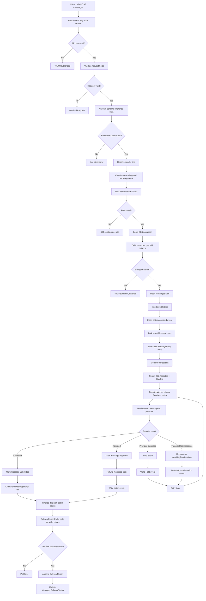

# 001 - SMS Send Lifecycle

Date: 2026-07-04

Purpose: show the current end-to-end SMS send flow from API acceptance through dispatch, provider outcomes, delivery-report polling, accounting, and batch timeline events.

Use this as the baseline diagram for later revisions. When the flow changes, add a new numbered diagram file instead of editing this one in place, unless the change is only a typo.

